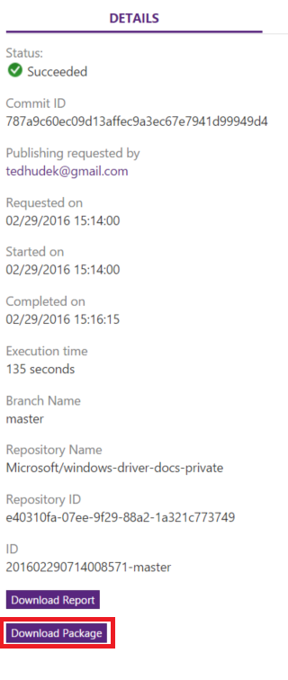

# Content publishing

Alike other systems, publishing to stage and live is done via branch management. Thus, you can assign one branch to be your sandbox, staging branch, and another to be your live branch. This is configured during [repo provisioning](../engdocs/repo-provision.md). 

In general:

- **master** branch is the branch associated with staging.
- **live** branch is the production branch associated with live.

Note that this means that once the content is committed to one of the corresponding branch, the content will automatically get published to their assigned environment. 

Both English and localized content follow the same logic for a given repo.

## Build status and reports
The submitter of the changes as well as those in the (notification list)[repo-config.md], will get a mail indicating whether the build is successful or not, a link to the documentation, as well as a link to the build report. 

Alternatively, teams can look at the [Open Publishing Portal](https://op-portal-sandbox.azurewebsites.net) for build status and logs of current and past builds.

## PDF build output
Make sure you have turned on the build of PDF in [publish configuration](publish-configuration.md#publish-config-need_generate_pdf).

When publish or build of pull request finishes, open OPS portal and go to `Publishing History` or `Pull Request` tab. There is a `Download Package` link in the `DETAILS` tab. Click `Download Package`.

After download finishes, unzip the downloaded package. The generated pdf(s) are in the folder. Each docset will be built into a PDF named by `{docset name}.{locale}.v{version}.pdf`.
